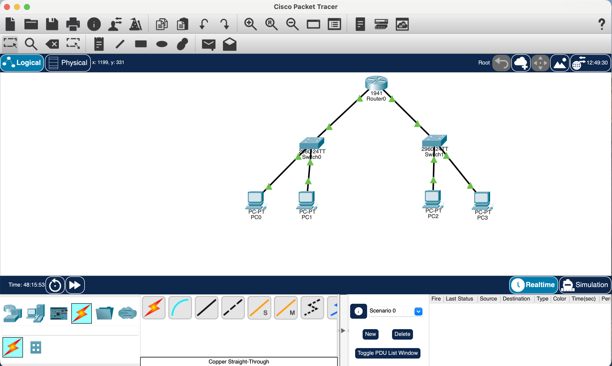
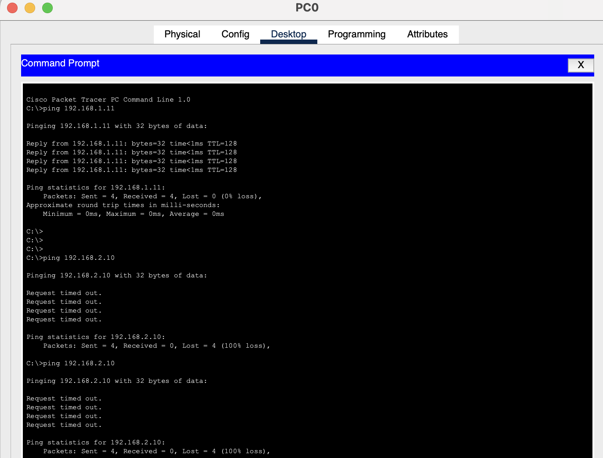

# CompTIA Network+ Home Lab — Cisco Packet Tracer
### Florian Razvan Cirstea | comptia-network-lab

## About This Repository

This repository documents hands-on networking projects completed as part of my CompTIA Network+ studies, using Cisco Packet Tracer to simulate real network infrastructure.

**Certification:** CompTIA Network+ — Completed February 2026  
**Verify:** https://cp.certmetrics.com/comptia/en/public/verify/credential/d866322433ab4cc5a9f53d4d47bbe47f

---

## Project 1 - Two-Network Router Configuration ✅

**Objective:** Build and configure a routed network with two separate subnets communicating through a router.

**Topology:**
- 1x Cisco 1941 Router
- 2x Cisco 2960 Switches
- 4x PCs (2 per switch)

**IP Addressing Scheme:**

| Device | Interface | IP Address | Subnet Mask | Gateway |
|--------|-----------|------------|-------------|---------|
| Router0 | Gi0/0 | 192.168.1.1 | 255.255.255.0 | — |
| Router0 | Gi0/1 | 192.168.2.1 | 255.255.255.0 | — |
| PC0 | NIC | 192.168.1.10 | 255.255.255.0 | 192.168.1.1 |
| PC1 | NIC | 192.168.1.11 | 255.255.255.0 | 192.168.1.1 |
| PC2 | NIC | 192.168.2.10 | 255.255.255.0 | 192.168.2.1 |
| PC3 | NIC | 192.168.2.11 | 255.255.255.0 | 192.168.2.1 |

**What I did:**
- Designed a two-subnet network topology in Cisco Packet Tracer
- Configured router interfaces with static IP addresses via CLI
- Enabled inter-VLAN routing between 192.168.1.0/24 and 192.168.2.0/24
- Configured static IP addresses on all end devices
- Verified connectivity with ping tests across both subnets

**Router CLI Configuration:**
enable
configure terminal
interface GigabitEthernet0/0
ip address 192.168.1.1 255.255.255.0
no shutdown
exit
interface GigabitEthernet0/1
ip address 192.168.2.1 255.255.255.0
no shutdown
exit
end
**Test Results:**
- PC0 → PC1 (same subnet): ✅ Success
- PC0 → PC2 (different subnet via router): ✅ Success
- PC0 → PC3 (different subnet via router): ✅ Success

**Skills demonstrated:** IP addressing, subnetting, static routing, router CLI configuration, network troubleshooting, Cisco IOS

**Screenshots:**
- 
- 

---

## Project 2 - DHCP Configuration 🔄 Coming Soon
## Project 3 - VLANs 🔄 Coming Soon
## Project 4 - DNS & HTTP Server 🔄 Coming Soon
