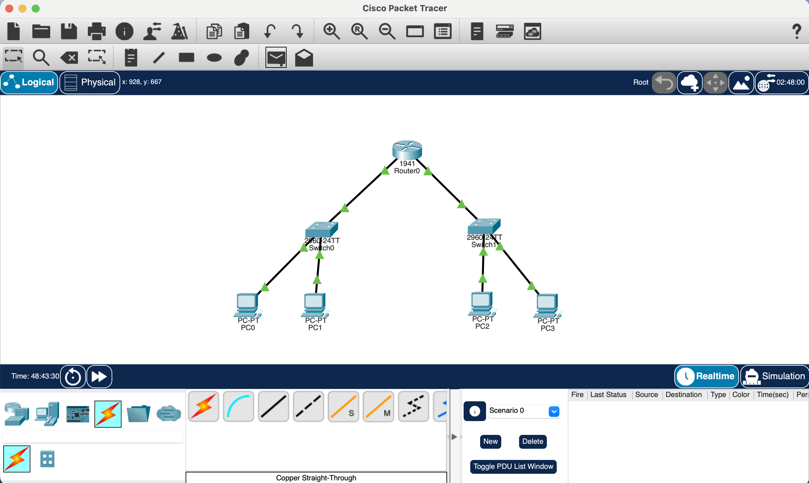
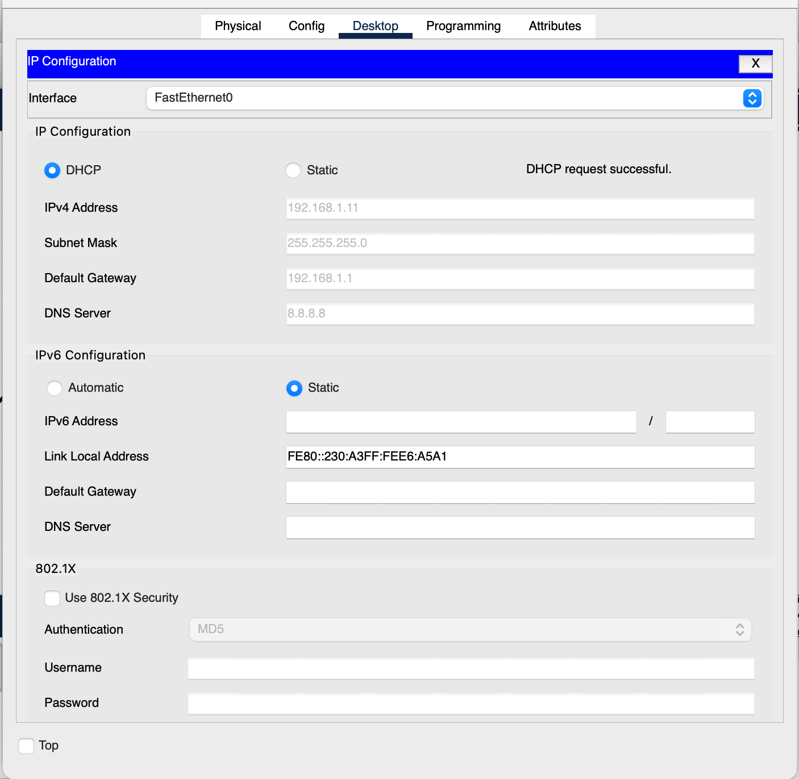
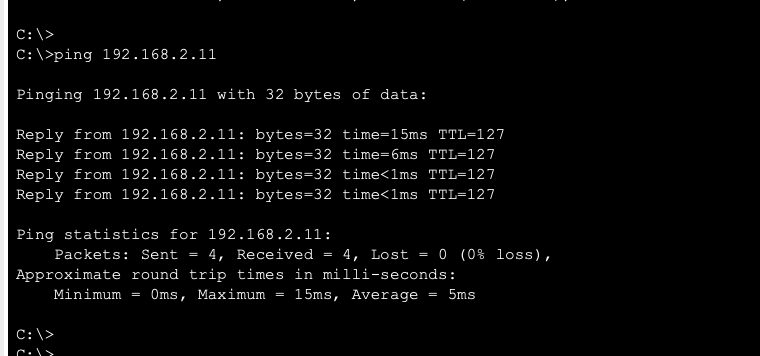
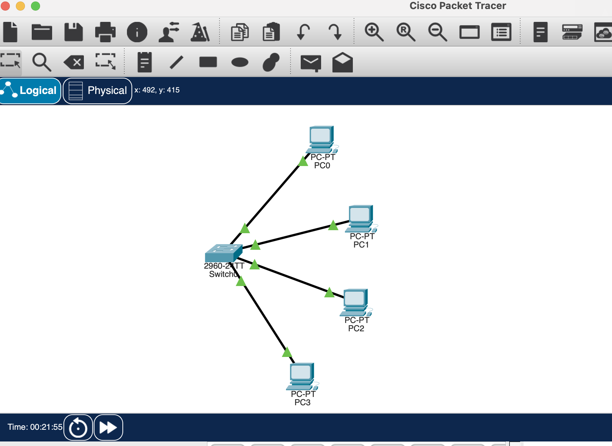
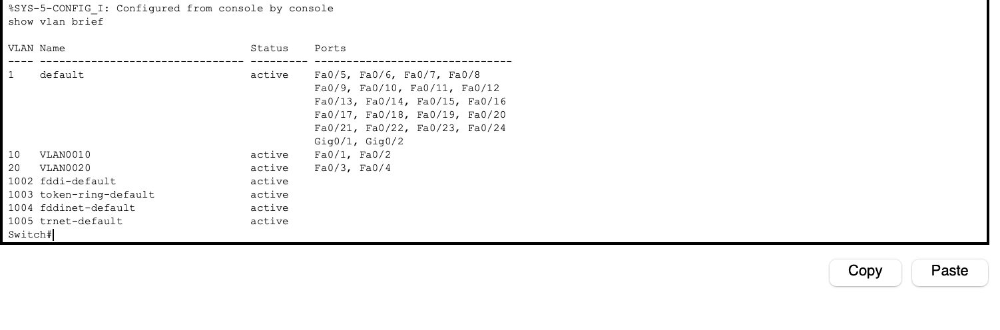
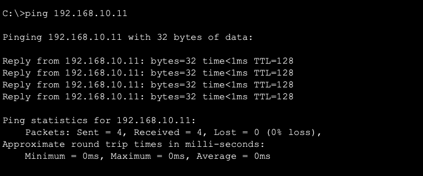
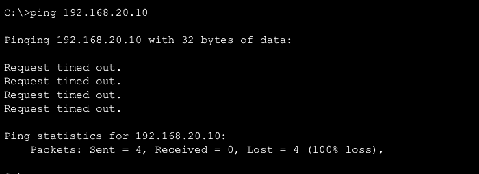

# CompTIA Network+ Home Lab — Cisco Packet Tracer
### Florian Razvan Cirstea | comptia-network-lab

## About This Repository

This repository documents hands-on networking projects completed as part of my CompTIA Network+ studies, using Cisco Packet Tracer to simulate real network infrastructure.

**Certification:** CompTIA Network+ — Completed February 2026  
**Verify:** https://cp.certmetrics.com/comptia/en/public/verify/credential/d866322433ab4cc5a9f53d4d47bbe47f

---

## Project 1 - Two-Network Router Configuration ✅

**Objective:** Build and configure a routed network with two separate subnets communicating through a router.

**Topology:**
- 1x Cisco 1941 Router
- 2x Cisco 2960 Switches
- 4x PCs (2 per switch)

**IP Addressing Scheme:**

| Device | Interface | IP Address | Subnet Mask | Gateway |
|--------|-----------|------------|-------------|---------|
| Router0 | Gi0/0 | 192.168.1.1 | 255.255.255.0 | — |
| Router0 | Gi0/1 | 192.168.2.1 | 255.255.255.0 | — |
| PC0 | NIC | 192.168.1.10 | 255.255.255.0 | 192.168.1.1 |
| PC1 | NIC | 192.168.1.11 | 255.255.255.0 | 192.168.1.1 |
| PC2 | NIC | 192.168.2.10 | 255.255.255.0 | 192.168.2.1 |
| PC3 | NIC | 192.168.2.11 | 255.255.255.0 | 192.168.2.1 |

**What I did:**
- Designed a two-subnet network topology in Cisco Packet Tracer
- Configured router interfaces with static IP addresses via CLI
- Enabled inter-VLAN routing between 192.168.1.0/24 and 192.168.2.0/24
- Configured static IP addresses on all end devices
- Verified connectivity with ping tests across both subnets

**Router CLI Configuration:**
enable
configure terminal
interface GigabitEthernet0/0
ip address 192.168.1.1 255.255.255.0
no shutdown
exit
interface GigabitEthernet0/1
ip address 192.168.2.1 255.255.255.0
no shutdown
exit
end
**Test Results:**
- PC0 → PC1 (same subnet): ✅ Success
- PC0 → PC2 (different subnet via router): ✅ Success
- PC0 → PC3 (different subnet via router): ✅ Success

**Skills demonstrated:** IP addressing, subnetting, static routing, router CLI configuration, network troubleshooting, Cisco IOS

**Screenshots:**
- 
- 

---
## Project 2 - DHCP Configuration ✅

**Objective:** Configure the router as a DHCP server for both subnets.

**What I did:**
- Configured two DHCP pools on Cisco 1941 router via CLI (LAN1 and LAN2)
- Set default gateway and DNS server (8.8.8.8) for each pool
- Excluded router IP addresses from DHCP range
- Switched all 4 PCs from static to DHCP
- Verified automatic IP assignment and inter-subnet connectivity

**Router DHCP Configuration:**

ip dhcp pool LAN1
network 192.168.1.0 255.255.255.0
default-router 192.168.1.1
dns-server 8.8.8.8
ip dhcp pool LAN2
network 192.168.2.0 255.255.255.0
default-router 192.168.2.1
dns-server 8.8.8.8
ip dhcp excluded-address 192.168.1.1 192.168.1.9
ip dhcp excluded-address 192.168.2.1 192.168.2.9

**Results:**
- PC0: 192.168.1.10 ✅
- PC1: 192.168.1.11 ✅
- PC2: 192.168.2.10 ✅
- PC3: 192.168.2.11 ✅
- Inter-subnet ping: 0% packet loss ✅

**Skills demonstrated:** DHCP configuration, Cisco IOS, IP address management, DNS configuration

**Screenshots:**
- 
- 
- 

## Project 3 - VLAN Configuration & Network Segmentation ✅

**Objective:** Configure VLANs on a Cisco switch to segment network traffic.

**Topology:**
- 1x Cisco 2960 Switch
- 4x PCs (2 per VLAN)

**VLAN Design:**

| VLAN | Name | Ports | Subnet |
|------|------|-------|--------|
| 10 | Management | Fa0/1, Fa0/2 | 192.168.10.0/24 |
| 20 | Sales | Fa0/3, Fa0/4 | 192.168.20.0/24 |

**What I did:**
- Created VLAN 10 (Management) and VLAN 20 (Sales) on Cisco 2960 switch
- Assigned access ports to each VLAN via CLI
- Configured static IP addresses on all PCs
- Verified intra-VLAN communication (PC0 → PC1): Success
- Verified inter-VLAN isolation (PC0 → PC2): Blocked — 100% loss

**Switch CLI Configuration:**

vlan 10
name Management
vlan 20
name Sales
interface FastEthernet0/1
switchport mode access
switchport access vlan 10
interface FastEthernet0/2
switchport mode access
switchport access vlan 10
interface FastEthernet0/3
switchport mode access
switchport access vlan 20
interface FastEthernet0/4
switchport mode access
switchport access vlan 20

**Test Results:**
- PC0 → PC1 (VLAN 10 → VLAN 10): ✅ 0% packet loss
- PC0 → PC2 (VLAN 10 → VLAN 20): ❌ 100% loss — segmentation working

**Skills demonstrated:** VLANs, network segmentation, switch configuration, Cisco IOS, access ports, security isolation

**Screenshots:**
- 
- 
- 
- 
- 
## Project 4 - DNS & HTTP Server 🔄 Coming Soon
